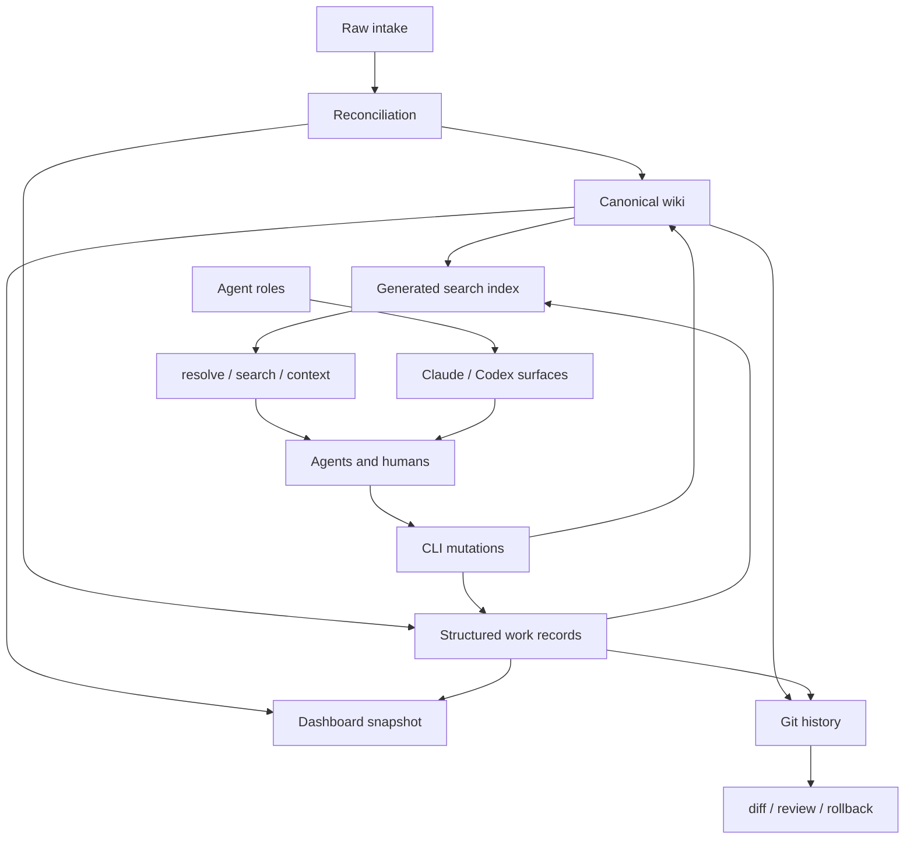

# Memory Magico

A local-first, Markdown-first memory harness for projects where humans and coding agents work from the same context. It gives agents a controlled path to ingest notes, reconcile them, maintain canonical project knowledge, plan and track work, log verification evidence, and pull focused context without relying on chat history.

Creation should be cheap. Promotion should be deliberate. Verification should be expensive.

The `memory/` directory is the durable source of truth: knowledge, work items, raw intake, generated indexes, and agent role instructions. The CLI is the interface agents use to search, resolve, read, mutate, and verify that memory.

The basic flow:

```text
capture cheaply -> reconcile deliberately -> promote to canonical memory -> execute with evidence -> verify before closure
```

Agent workflows tend to fail in predictable ways: context gets trapped in chats and screenshots, agents duplicate work because they can't tell what already exists, "done" gets declared without tests or evidence, raw notes get rewritten before anyone decides what they mean, and generated context drifts from canonical truth. MemoryMagico's structure — separate raw intake, canonical wiki pages, structured work records, generated indexes, and agent instructions — is aimed at those specific failure modes.

---

## Git as the memory log

Project memory lives as plain files in the repo, not in a database or hidden agent state. That means every memory change is diffable, reviewable as a PR, revertible, branchable, and blameable — you can see when a claim, task, or decision entered the project, and roll it back if it's wrong.

```bash
git status --short
mm lint --json
mm index rebuild
git diff -- memory/
git add memory/
git commit -m "memory: record hardening audit findings"
```

For agent-heavy work this matters more, not less. Agents can write useful memory, but only if a human can inspect the diff, reject a bad change, or require evidence before merging. Rule of thumb: no memory mutation is trusted until it shows up in `git diff` and passes the standard checks.

---

## Core concepts

| Concept | Purpose |
|---|---|
| Raw intake | Immutable source material: notes, files, screenshots, terminal output, audit findings, exports, pasted content. |
| Wiki pages | Canonical Markdown/YAML knowledge — the pages agents should trust first. |
| Work records | Initiatives, sprints, phases, tasks, issues, discoveries, comments, containers. |
| Claims | Explicit assertions with confidence and source references; contradictions can be recorded. |
| Relationships | Typed graph edges between issues, tasks, wiki pages, raw items, files, commits, and other entities. |
| Generated indexes | Search, page, chunk, and dashboard artifacts derived from canonical memory — rebuildable, disposable. |
| Agent roles | Source-controlled instructions installed into Claude Code or Codex-style agent surfaces. |
| Git history | The audit trail for every memory mutation, including agent edits, decisions, evidence, and rollbacks. |

The agent-facing rules are short: raw sources are immutable, wiki pages are canonical, generated indexes are disposable, agents resolve before they mutate, and verification evidence is required before anything is marked done.

---

## Architecture



```text
memory/            durable source of truth — wiki, work records, raw intake, agent roles
src/, bin/         the mm CLI
schemas/           JSON schema guardrails
templates/         bundled default agent role definitions
```

Full repository layout, path resolution (`toolRoot`/`repoRoot`/`memoryRoot`), and dev setup live in [CONTRIBUTING.md](CONTRIBUTING.md).

---

## Installation

### Prerequisites

Node.js 18 or newer. A Git repo is strongly recommended — Git is the audit log, review surface, and rollback mechanism for memory changes.

### Local install

```bash
npm link
mm init
mm doctor
mm index rebuild
```

`mm init` is interactive when run from a terminal: it asks which repo should receive `.memorymagico.json`, where the memory folder should live, whether that memory folder should be a separate git repo/folder or live inside the selected repo, where generated agent files should be installed, and which agent integration to install. This keeps the npm package code outside the project while binding the local `mm` command to one explicit memory workspace.

```bash
mm init
mm init --yes --project-root ~/projects/app --memory-root ~/projects/memory --separate-git
mm init --yes --project-root ~/projects/app --memory-root ~/projects/memory --install-root ~/projects
mm init --yes --project-root ~/projects/app --in-repo-memory --skip-agent-install
```

Run non-interactively (e.g. from CI or a script) and `mm init` skips the wizard. Use `--project-root` to choose where the project pointer is written, `--memory-root` to choose the actual memory workspace, and `--install-root` when `.agents/` or `.claude/` should live in a top-level folder beside both the project repo and `memory/`. After setup, `mm` resolves from the nearest pointer and validates its `workspaceId` against `memory/.mm/manifest.json`.

`package.json` needs to declare the CLI entrypoint before `npm link` will work:

```json
{
  "type": "module",
  "bin": {
    "mm": "./bin/mm.mjs",
    "memorymagico": "./bin/mm.mjs"
  }
}
```

### Direct source usage

```bash
node bin/mm.mjs init
node bin/mm.mjs doctor
node bin/mm.mjs index rebuild
```

Or alias it:

```bash
alias mm="node $(pwd)/bin/mm.mjs"
```

---

## Quick start

```bash
mm init
mm doctor
mm index rebuild
```

Create a canonical wiki page:

```bash
mm wiki create "Delivery Check" --kind concept
mm search "delivery check"
mm resolve "delivery check"
mm context "delivery check" --deep
```

Add a raw note and inspect it:

```bash
mm raw add --text "Need to document how sprint launch agents should verify task evidence."
mm raw list
mm raw show raw_...
```

Promote or reconcile it:

```bash
mm ingest raw_...
mm index rebuild
mm raw process raw_... wiki_page wiki_delivery_check memory/wiki/concepts/delivery-check.md
```

Health checks:

```bash
mm doctor
mm lint
mm index status
```

---

## CLI overview

```bash
mm <command> [subcommand] [...args]
```

```bash
mm help
mm help search
mm commands
mm commands --json
mm info
```

Most read commands support `--json`; agents should use it when parsing results programmatically.

---

## Safety model

Raw intake is immutable: source material is captured before interpretation and isn't rewritten in place. Promotion is deliberate: raw items get reconciled against existing records and checked for duplicates or staleness before being promoted. Reads are bounded: agents use `mm read` instead of unbounded file reads. Output is machine-readable where it matters, via `--json`. Writes are lock-protected and atomic to avoid partial artifacts. Tasks and issues require real verification evidence before they can be closed. The dashboard binds to `127.0.0.1` by default. Generated artifacts (search index, dashboard data) are disposable and get rebuilt from canonical memory, not hand-edited. And every meaningful mutation should be visible in `git diff -- memory/` before it's trusted or merged — for large reconciliations, sprint launches, or refactors, do that work on a dedicated branch or worktree.

---

## Learn more

| Doc | Covers |
|---|---|
| [CLI.md](CLI.md) | Full command reference, all flags, status/lifecycle values, troubleshooting. |
| [docs/workflows.md](docs/workflows.md) | End-to-end cookbook: raw capture, reconciliation, sprints, issue verification gates. |
| [docs/agent-system.md](docs/agent-system.md) | Agent role definitions, installation, rules, and the execution checklist. |
| [CONTRIBUTING.md](CONTRIBUTING.md) | Full repository layout, dev setup, and testing. |
| [DESIGN_NOTES.md](DESIGN_NOTES.md) | The governing rule and canonical-relationship conventions. |

---

## Roadmap

- `mm status` — one-screen workspace health summary.
- `mm safe` — `doctor + lint + index status + graph validation` in one command.
- `mm audit` — hardening probes and command contract checks.
- `mm snapshot`, `mm restore`, `mm rollback` — safer agentic mutation.
- Stricter JSONL parsing in lint paths.
- Uniform path containment checks at every command boundary.
- Prompt-injection rules in every generated agent surface.
- Append-only mutation log for every state transition.
- Optional SQLite backend for high-concurrency agent runs.
- Shell completions generated from the command registry.

---

## License

TBD.
